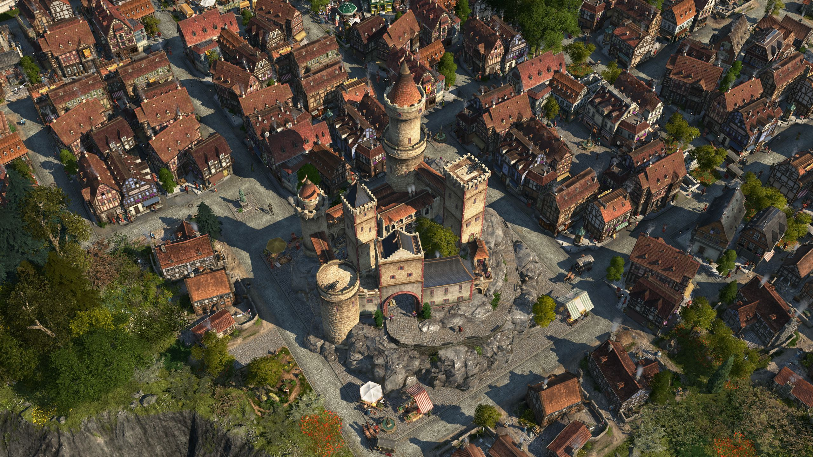
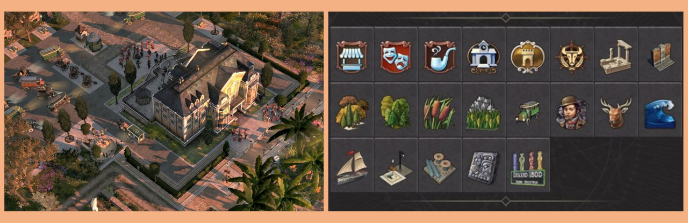
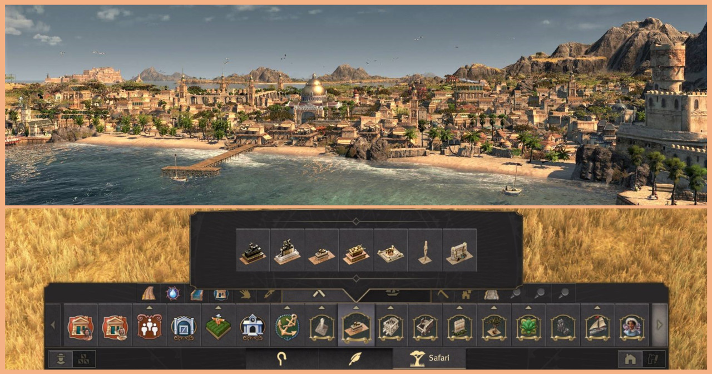
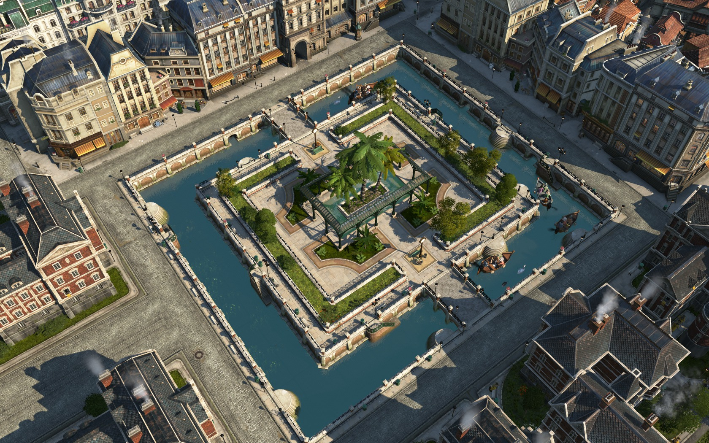
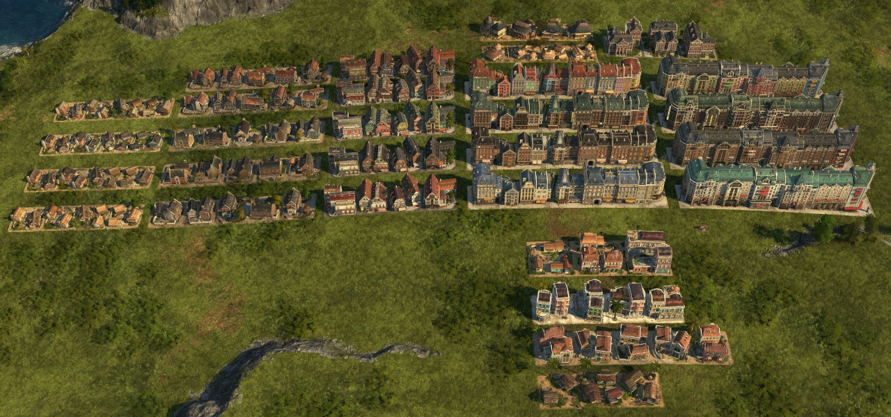
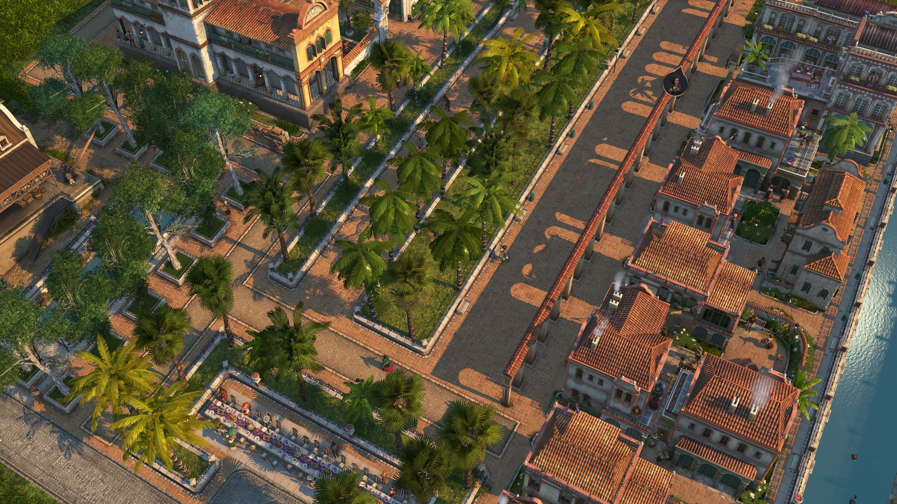
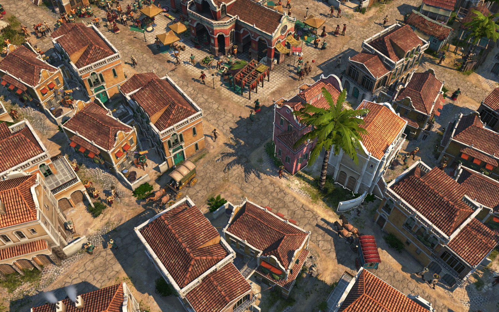
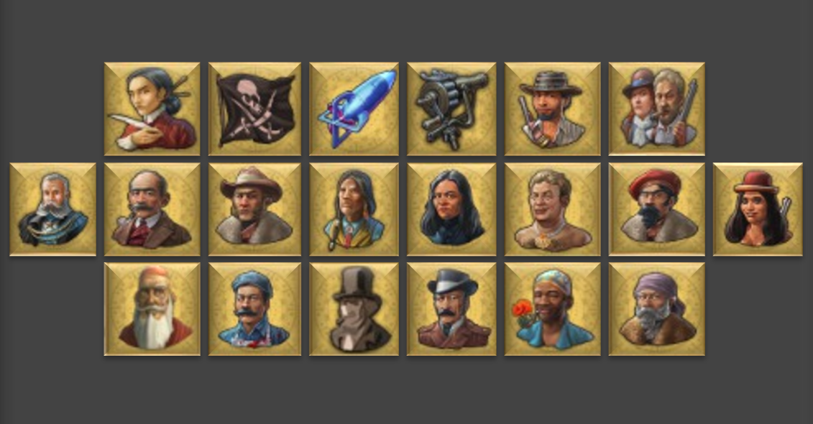

# Mods for Anno 1800

## How to use

1. Download and install the latest mod-loader for Anno 1800 from the corresponding Github page: https://github.com/xforce/anno1800-mod-loader
2. Download the mod files (.zip format) and extract them to your Anno mods folder. Alternatively use a mod-manager, i.e. I-mod-your-Anno (IMYA)
3. All mods work with new and existing save games

## Enbesa Spectacles Production

This mod adds the possibility to produce spectacles in Enbesa. Therefore it adds a custom sand mine, a soda factory, a glass maker and a spectacles factory. The soda factory is meant to provide a new demand for the vast amount of unused pearls that some Old-World-items generate as an additional output.

For the soda factory there is a new epic item, which is available at Ketema´s trading post or via the Research Institute.

**Why Soda?** 

*Soda is the common name of sodium carbonate (Na2CO3), a salt of carbonic acid. It occurs naturally as a mineral in small amounts, but due to its importance in numerous industrial processes it also has to be produced artificially. Whether as a flux in glass production or as a component of detergents, soda is one of the most important chemical raw materials today. Large-scale production began at the end of the 18th century with the Leblanc process, which soon turned out to be harmful to the environment. In 1860, the chemist Ernest Solvay invented a new process that reduced environmental pollution: the "ammonia soda" or "Solvay process". Basically it requires calcium carbonate (lime) (pearls are nothing else), CO2, a lot of water, sodium chloride (salt) and ammonia (which mostly stays in the process and is reused). Today, however, with new technical possibilities, the Leblanc process is also gaining interest again. As part of this mod, the real process is greatly simplified, just as pearls are not a realistic source of lime. But in Anno 1800 there are tons of them like sand by the sea... :D*

#### Requirements: 
- Land of Lions DLC

## Ornamental Trains

This mod adds eight ornamental freight train variations and two subway train cars. 

**Variations:** 

- Freight train locomotive
- Freight train with gas bottles
- Freight train with boxes / cloths
- Freight train with bricks
- Freight train with steam carriages
- Freight train with coal
- Freight train with liquids
- Freight train with wood logs
- Subway with driver´s cab 
- Subway without driver´s cab

**How to build:** 

- Trains are sized 2x1 tiles. 
- Change appearance with `ctrl`+`V` (default) 
- They build their tracks automatically after placing. You can connect them with the tracks from the powerplant / fuel station. Therefore drag the tracks into the trains.  
- After deleting a train segment, you have to delete the "artefacts" of the railroads separately.

**Storage capacity:** 

- Freight trains increase the storage capacity of nearby warehouses (vanilla & spice) by 5t each. Radius is 8 tiles. 
- Change the amount and radius with IModYourAnno-tweaks. 

**Menu Location:** 

Available in the Old and New World: 
- Population tier category: Beautification Menu --> Classic 
- Building type category: Beautification Menu --> Industry 

## Knight´s Castle: Local Department Variation

This mod adds a knight´s castle as a variation for the Local Department. 

- Properties / values ​​are exactly the same as in the vanilla local department except for an extra attractivity. 
- The castle is unlocked when you once built a palace and by default one castle per island is allowed.
- Change the attractivity bonus and if you want to build the castle as many times per island as you want with IModYourAnno-tweaks.
- The tile size of the building is not completely square, at two corners you can overbuild the ground texture with ornaments. 

**Menu Location:** 

- Palace Menu --> next to Local Department

#### Requirements: 
- Seats of Power DLC

## More Variety Old World

This mod adds various ornaments and functional buildings to the game. Have a look at the ReadMe for a detailled description or visit the respective Nexus page for more pictures: https://www.nexusmods.com/anno1800/mods/294

## Safari to Old Enbesa

This mod adds various ornaments and functional buildings to the game. Have a look at the ReadMe for a detailled description or visit the respective Nexus page for more pictures: https://www.nexusmods.com/anno1800/mods/269

## Culture Modules as Ornaments

This mod adds the culture modules of museum, botanical garden and some from the zoo as ornaments. No items needed.

- Each module comes with +25 attractiveness by default. Change the amount with IModYourAnno-tweaks.

**Menu Location:**

Available in the Old World, New World and Enbesa:
- Population tier category OW / NW: Beautification menu --> Classic
- Building type category OW / NW: Beautification menu --> City
- Enbesa: Elder tier (next to monastery)

## Ornamental Residences

Build farmer, worker, artisan, engineer, investor, scholar, jornalero, obrero, artista, shephard, elder and hacienda residences without street connection to fill gaps in your cities. 

- To change the skin (Vibrant Cities cDLC required) use the skin painter tool from the tool bar.
- Residences are available in the Old World, New World and Enbesa.

**Menu Location:**

- Population tier category OW / NW: Beautification menu --> Classic
- Building type category OW / NW: Beautification menu --> City
- Enbesa: Elder tier (next to monastery)

## Enclosed Greenery and Tree

This mod adds palm tree variations for the Enclosed Greenery and jungle tree variations for the Enclosed Tree from the Pedestrian Zone CDLC.

- Available ground textures: Vanilla plaza tiles and hacienda bricks
- Change variations with `ctrl`+`V` for the enclosed trees 

**Menu Location:**

Available in the Old and New World:
- Where the vanilla greenery is found --> Beautification Menu --> Cosmetic --> Pedestrian Zone Pack

#### Requirements: 
- Pedestrian Zone cDLC

## Enbesa Streets for Old and New World

This mod adds the stone and dirt street (incl. bridges) from Enbesa to the Old and New World session.

- Enbesian stone street is overbuildable by the OW / NW-stone street and vice versa.
- Instead of mud bricks you need OW / NW bricks.

**Menu Location:**

Available in the Old and New World:
- Unlocked at 200 Farmers / Jornaleros
- Population tier category: Farmers / Jornaleros --> next to dirt street 
- Building type category: City --> next to dirt street 

#### Requirements: 
- Land of Lions DLC

## Legendary Seeds Enbesa

This mod adds legendary items for Enbesan fertilities. Available at Ketema´s harbour and the Research Institute. 
For a detailled description on what every item does as well as pictures have a look at the respective Nexus page: https://www.nexusmods.com/anno1800/mods/249

## Legendary Items

This mod adds 21 legendary items, meant to drastically ease your game for beauty building. 
For a detailled description on what every item does as well as pictures have a look at the respective Nexus page: https://www.nexusmods.com/anno1800/mods/245

