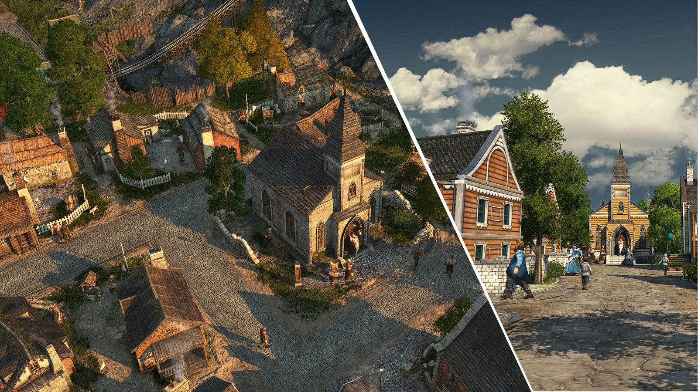

# Mods for Anno 1800

## How to use

Download the zipped mods you want from the "releases" section on the right and extract them to your Anno mods folder. Read the ReadMe files attached to each mod!
Some mods can be tweaked with the mod-manager [I-mod-your-Anno (IMYA)](https://github.com/anno-mods/iModYourAnno).

## Subway Network

Establish a subway network in your metropolises.

- Unlock: At 7.000 investors.
- Menu Location: Tab "Investors" next to *Steam Carriages* and Tab "Public Services" next to the *Members Club*.
- By default, Engineers and Investors demand a Subway Network. With *I-mod-your-Anno* you can activate the demand for Workers, Artisans and Scholars as well.
- For more pictures, visit the respective Nexus page.

## How a subway network is supposed to work 

1. Build a Metropolitan Transport Department (MTD). Once built, all other buildings of this mod get unlocked.  
2. Produce subways with the subway factory and its modules.
3. Produce tickets with the tickets recipe factory.
4. Build midsize or large subway stations. Every station is a monument with 2 phases.
5. Supply your finished stations with subways, tickets and light bulbs. Output will be the public service "Subway".
6. Select a policy in the MTD to get additional buffs for residences and public services within station range. 
7. Upgrade your MTD after reaching a certain number of subway stations to get access to better policies.  

### Installation

- Unzip this modfile and drag it into your Anno 1800 mods directory.

<b>Details</b> <i>Click to expand</i>

### Metropolitan Transport Department:

- One department per island is allowed.
- There are three upgrade stages, which are unlocked at 5, 10 and 15 stations (globally). At the first time you´ll receive messages from Mr. Bader if the MTD is ready for an upgrade. To upgrade, you have to use the toolbar upgrade tool.
- Each stage offers one more policy, which forwards buffs to the subway stations. The stations then affects all public services and engineer / investor residences within their street range.
- If you demolish all of your departments, all mod buildings will be locked in the menu, until you build a department again. 

### Subway Stations:

- Midsize and Large Subway Stations mainly differ in tile size: 3x3 vs. 3x5. Range and buffs are the same.
- Once their monument stages are finished and they are supplied with their demanded input goods, they provide their public service within their street range. No input goods = no public service.
- There are 11 skins available for the large subway station and 6 skins for the midsize subway station.
- By default they can not be paused manually (toggleable with IMYA). This is a compromise, since the policy buffs are applied on them even when they do not receive their inputs (game limitation). If you don't like policies because of that, don't use them.
- You may want to give your stations a name in the UI (default is High Street; random dice is deactivated)

### Subway Factory and its Modules:

The subway factory produces subways from motors, glass and steel. It can be used as a stand-alone building or in combination with modules.
Subway factory modules require workforce and cost maintenance, some of them additionally require input goods. In return modules provide certain buffs within radius and / or output goods:
 
1. Factory Entrance Module: Input (Police Equipment) = Output (when processing: Buff on subway factory and modules)
2. Administration Office Module: Input (Telephones, Typewrighters, Paper) = Output (when processing: Buff on subway factory and modules)
3. Material Development Module: Input (Quartz Sand, Aluminium Profiles) = Output (when processing: Buff on Pressworks Module + change its input from Steel to Aluminium Profiles and Tallow to Lubricant)
4. Pressworks Module: Input (Steel, Tallow) = Output (Metal Sheets) + (when processing: Buff on subway factory + change its input from Steel to Metal Sheets) 
5. Cable Factory Module: Input (Copper, Caoutchouc) = Output (Cables) + (when processing: Buff on subway Factory)  
6. Motor Assembly Plant Module: Input (Cables, Celluloid, Steel) = Output (Motors) + (when processing: Buff on subway factory) 
7. Warehouse Module: 4 transporter slots, +25 tons storage capacity
8. All other Modules: No Input = Output (Buff on subway factory)

For some modules there are skins available. In most cases the only difference is, whether the building adapts to terrain height or not.

Exception: For the "Connection Tower" module there are variations available instead of a skin to automatically adapt to their neighbor. However this only works for same sized buildings. If the tile size is different, place the tower and all the neighbors first, then select the "Connection Tower" with the "Relocate Tool" and just drop it again. The tower module has now adapted to the neighbors.   

### Printing Factory:

- Tickets can be produced by three different recipes which all require paper and lacquer, but differ in the used pigment / dye (coal, indigo or mineral pigments).
- Three skins with a different wall and roof color are available per recipe.

### Additional Hints:

- The "Common Productivity Buff" which many subway factory modules provide is only shown at the top of the the module's UI, but hidden in the affected subway factory to avoid a littered UI.
- If you use the unlimited resources option of a trainer (like WeMod F11), you have to delete the follwing file in this mod first: data/config/export/main/asset/assets.zzz.statistics.include.xml (you can ignore the resulting warning about a missing file in the mod-loader log) 

### Known Issues

- The policies don´t show the affected targets in the policy-infotip of the MTD-UI (somehow a game limitation). 

Don't hesistate to report any gameplay, graphics or text bugs.

## Old World Chapel

This mod adds a chapel to the Old World. It fulfills the luxury need for a church, farmers have from now on, when reached 200 farmers. Range is smaller than the one from the vanilla workers church; you can tweak it with IMYA. 

## Paper Mill Old World

This mod allows you to produce paper in the Old World. Therefore you can choose between different recipes:
- The first one is unlocked at 750 workers and consumes working clothes.
- The second one is unlocked at 750 engineers and consumes wood, cement and sulfide, which can be obtained by modules built next to iron, copper or zinc mines. 
The more advanced the production process the higher the output, but also the more advanced the required input materials. Read the ReadMe for a more detailed recipe description. 

This mod is considered as a shared mod, so feel free to add more recipes and / or change the buildings appearance. You'll find a short "How to" in the assets.xml.

## Small Bus Stop 

This mod adds a small bus stop (2x1 tiles) as an alternative to the 2x3 sized vanilla bus stop as well as a red and a yellow doubledecker as bus skins. Find the small bus stop located next to the vanilla one in the tourists menu. Unlocked with the vanilla bus stop.

#### Hard Requirement: 
- Tourist DLC

## Enbesa Spectacles Production

This mod adds the possibility to produce spectacles (glasses) in Enbesa. Therefore it adds a custom sand mine, a soda factory, a glass maker and a spectacles factory. The soda factory is meant to provide a new demand for the vast amount of unused pearls that some Old-World-items generate as an additional output.

For the soda factory there is a new epic item, which is available at Ketema´s trading post or via the Research Institute.

  
<b>Why Soda?</b> <i>Click to expand</i>
 

*Soda is the common name of sodium carbonate (Na2CO3), a salt of carbonic acid. It occurs naturally as a mineral in small amounts, but due to its importance in numerous industrial processes it also has to be produced artificially. Whether as a flux in glass production or as a component of detergents, soda is one of the most important chemical raw materials today. Large-scale production began at the end of the 18th century with the Leblanc process, which soon turned out to be harmful to the environment. In 1860, the chemist Ernest Solvay invented a new process that reduced environmental pollution: the "ammonia soda" or "Solvay process". Basically it requires calcium carbonate (lime) (pearls are nothing else), CO2, a lot of water, sodium chloride (salt) and ammonia (which mostly stays in the process and is reused). Today, however, with new technical possibilities, the Leblanc process is also gaining interest again. As part of this mod, the real process is greatly simplified, just as pearls are not a realistic source of lime. But in Anno 1800 there are tons of them like sand by the sea... :D*

#### Hard Requirement: 
- Land of Lions DLC

## Ornamental Trains

This mod adds eight ornamental freight train variations and two subway train cars. 

<b>Details</b> <i>Click to expand</i>
 
  
**Variations:** 

- Freight train locomotive
- Freight train with gas bottles
- Freight train with boxes / cloths
- Freight train with bricks
- Freight train with steam carriages
- Freight train with coal
- Freight train with liquids
- Freight train with wood logs
- Subway with driver´s cab 
- Subway without driver´s cab

**How to build:** 

- Trains are sized 2x1 tiles. 
- Change appearance with `ctrl`+`V` (default) 
- They build their tracks automatically after placing. You can connect them with the tracks from the powerplant / fuel station. Therefore drag the tracks into the trains.  
- After deleting a train segment, you have to delete the "artefacts" of the railroads separately.

**Storage capacity:** 

- Freight trains increase the storage capacity of nearby warehouses (vanilla & spice) by 5t each. Radius is 8 tiles. 
- Change the amount and radius with IModYourAnno-tweaks. 

**Menu Location:** 

Available in the Old and New World: 
- Population tier category: Beautification Menu --> Classic 
- Building type category: Beautification Menu --> Industry 

## Knight´s Castle: Local Department Variation

This mod adds a knight´s castle as a variation for the Local Department. 

<b>Details</b> <i>Click to expand</i>
 
  
- Properties / values are exactly the same as for the vanilla local department except for some extra attractivity. 
- The castle is unlocked when you once built a palace and by default one castle per island is allowed.
- IModYourAnno-tewaks: If you want to build the castle as many times per island as you want you can toggle it there.
- The tile size of the building is not completely square, at two corners you can overbuild the ground texture with ornaments. 

**Menu Location:** 

- Palace Menu --> next to Local Department
  

#### Requirements: 
- Seats of Power DLC

## Safari to Old Enbesa

This mod adds various ornaments and functional buildings to the game. Have a look at the ReadMe for a detailled description or visit the respective Nexus page for more pictures: https://www.nexusmods.com/anno1800/mods/269

## More Variety Old World

This mod adds various ornaments and functional buildings to the game. Have a look at the ReadMe for a detailled description or visit the respective Nexus page for more pictures: https://www.nexusmods.com/anno1800/mods/294

## Enclosed Greenery and Tree New World

This mod adds palm tree variations for the Enclosed Greenery and jungle tree variations for the Enclosed Tree from the Pedestrian Zone CDLC.

- Available ground textures: Vanilla plaza tiles and hacienda bricks
- Change variations with `ctrl`+`V` for the enclosed trees
- Available in the Old and New World --> Beautification Menu --> Cosmetic --> Pedestrian Zone Pack 

#### Hard Requirement: 
- Pedestrian Zone cDLC

## Culture Modules as Ornaments

This mod adds the culture modules of museum, botanical garden and some from the zoo as ornaments. No items needed.

- Each module comes with +25 attractiveness by default. Change the amount with IModYourAnno-tweaks.
- Available in the OW / NW / Enbesa --> Beautification Menu --> Classic / City / Elders

## Ornamental Residences

Build farmer, worker, artisan, engineer, investor, scholar, jornalero, obrero, artista, shephard, elder and hacienda residences without street connection to fill gaps in your cities. 

- To change the skins the "Vibrant Cities cDLC" is required.
- Residences are available in the Old World, New World and Enbesa --> Beautification Menu --> Classic / City / Elders

## Enbesa Streets for Old and New World

This mod adds the stone and dirt street (incl. bridges) from Enbesa to the Old and New World session.

- Enbesian stone street is overbuildable by the OW / NW-stone street and vice versa.
- Instead of mud bricks you need OW / NW bricks.
- Available in the Old and New World --> Farmers / Jornaleros / City, next to dirt street. Unlocked at 200 farmers / Jornaleros.

#### Hard Requirement: 
- Land of Lions DLC

## Legendary Seeds Enbesa

This mod adds legendary items for Enbesan fertilities. Available at Ketema´s harbour and the Research Institute. 
For a detailled description on what every item does as well as pictures have a look at the respective Nexus page: https://www.nexusmods.com/anno1800/mods/249

## 21 Legendary Items

This mod adds 21 legendary items, meant to drastically ease your game for beauty building. 
For a detailled description on what every item does as well as pictures have a look at the respective Nexus page: https://www.nexusmods.com/anno1800/mods/245

