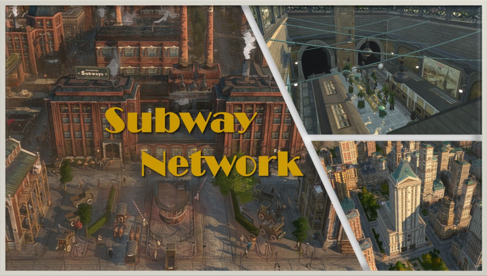
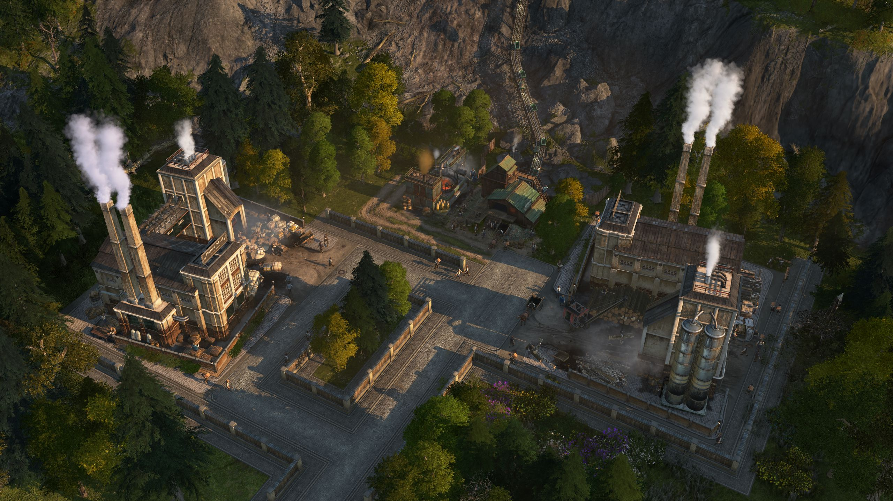
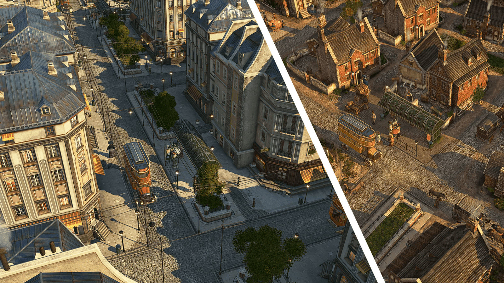

# Mods for Anno 1800

## How to use

Download the zipped mods you want from the "releases" section on the right and extract them to your Anno mods folder. Read the ReadMe files attached to each mod!
Some mods can be tweaked with the mod-manager [I-mod-your-Anno (IMYA)](https://github.com/anno-mods/iModYourAnno).

# Subway Network 2.0

Establish a subway network in your metropolises.

### How a subway network is supposed to work 

1. Build a Metropolitan Transport Department (MTD). Once built, all other buildings of this mod get unlocked.
2. Build a Subway Depot. Supply it with Tools.
3. Produce Subways with the Subway Factory and its modules.
4. Produce Tickets with the Tickets Recipe Factory.
5. Build midsize or large Subway Stations. Every station is a monument with 2 phases.
6. Supply your finished stations with Subways, Tickets and Lightbulbs. Output will be the public service "Subway".
7. Upgrade your MTD after reaching a certain number of subway stations (quest tells you when and where) to get access to better level-buffs.

<b>Details</b> <i>Click to expand</i>

 
### Metropolitan Transport Department (MTD):

- One department per island is allowed.
- There are 3 upgrade stages, which are unlocked at 5, 10 and 15 stations (per island). When a MTD is ready for an upgrade, you recieve a quest, so you can't miss it. To upgrade, you have to use the upgrade tool from your tool-bar.
- Each stage enables a certain Subway Network Level (4 in total: default + 3 upgrades). Each Level comes with certain buffs. These buffs are spreaded by the Subway Stations.
- You can change the visual appearance of higher stages to the visual appearance of lower stages if you want (default hotkey is Ctrl V).
- If you demolish all of your departments (globally), all mod buildings will be locked in the menu, until you build a department again.

### Subway Stations:

- Midsize and Large Subway Stations mainly differ in tile size: 3x3 vs. 3x5. Range and buffs are the same.
- Once their monument stages are finished and they are supplied with their demanded input goods, they provide their public service and buffs within their street range.
- There are 11 skins available for the large subway station and 6 skins for the midsize subway station.
- You may want to give your stations a name in the UI (default is Baker Street; random dice is deactivated)

### Subway Factory and its Modules:

The Subway Factory produces Subways from Motors, Glass and Steel. It can be used as a stand-alone building or in combination with modules.
Subway Fctory Modules require workforce and cost maintenance, some of them additionally require input goods. In return modules provide certain buffs within radius and / or output goods:

1. Factory Entrance Module: Input (Police Equipment) = Output (when processing: Buff on subway factory and modules)
2. Administration Office Module: Input (Telephones, Typewrighters, Paper) = Output (when processing: Buff on subway factory and modules)
3. Material Development Module: Presocketed action-items, which can be (de)activated by the player = Changes inputs of other modules to more complicated ones, in return provides buffs.
4. Pressworks Module: Input (Steel, Tallow) = Output (Metal Sheets) + (when processing: Buff on subway factory + change its input from Steel to Metal Sheets)
5. Cable Factory Module: Input (Copper, Caoutchouc) = Output (Cables) + (when processing: Buff on subway Factory)
6. Motor Assembly Plant Module: Input (Cables, Glass, Steel) = Output (Motors) + (when processing: Buff on subway factory)
7. Warehouse Module: 4 transporter slots, +25 tons storage capacity
8. All other Modules: No Input = Output (Buff on subway factory)

For some modules there are skins available. In most cases the only difference is, whether the building adapts to terrain height or not.

Exception: For the "Connection Tower" module there are variations available instead of a skin to automatically adapt to their neighbor. However this only works for same sized buildings. If the tile size is different, place the tower and all the neighbors first, then select the "Connection Tower" with the "Relocate Tool" and just drop it again. The tower module has now adapted to the neighbors.

### Printing Factory:

- Tickets can be produced by three different recipes. All of them require paper, which can be produced in Enbesa (Land of Lions DLC) or in the Old World via the Advanced Paper Mill mod(included in this mod). The recipes differ in the used pigment / dye (Coal, Indigo (Land of Lions DLC) or Mineral Pigments (New World Rising DLC)).
- Three skins with a different wall and roof color are available per recipe.

# Enbesa Tourism

This mod takes the tourists to Enbesa.

### How do tourists work in Enbesa

**1.** Build a tourist pier to enable the Tourists. This will also enable the vanilla visitor mechanic, so you will get specialists from time to time depending on your island's attractiveness.

**2.** In Enbesa tourists live in a Lodge. A Lodge consists of its Main Building and its Lodge Modules. While the Main Building provides a service to your tourists, the modules are their actual residence (4 variations).

**3.** Fulfill the needs of your tourists. These include some consumable products from Enbesa, the Old as well as the New World. However, the focus is on public service buildings, which are listed below:

- Tourism Pier: Unlike to the Old World, the service is provided by street. There´s no bus connection needed.
- Lodge Main Building
- Market: the vanilla market does the trick, but for those who prefer a smaller footprint there are 3x1 streetmarkets with a smaller range as well.
- Restaurant and Bar: Choose from 4 local recipes each. The recipes provide small buffs to Shepherds and Elders (& Extended Families with Safari to Old Enbesa).
- Airballoon Tour: In order to provide its service, this building needs sails as input.
- Souvenir Shop: In order to provide its service, this building needs chronicles, tapestries and ceramics as inputs.
- Nationalpark (see below for details)

<b>Details</b> <i>Click to expand</i>

###
**4.** Nationalpark: Consists of its Main Building and its modules:

- The Main Building provides its service via street range. By default this range is very short, so you are forced to build Nationalpark Modules.
- There are 10 different modules, representing the different biomes of Enbesa: Miombo Woodlands, Teeming Lakes, Proud Savannah, Enbesan Highlands and Great Desert.
- Each module on an island increases the public service range of each Main Building on an island. The current range buff is shown via infotip when you click on a Main Building.
- Additionally, to force you to build different modules, each of them provide a different hotspot need. Like in the Old World, hotspot needs are provided by bus: Connect the Pier, your Nationalpark modules and your Lodge modules via bus to fullfill your tourist's hotspot needs. This is your actual "Safari" through a Nationalpark.

**5.** Bus: To establish a bus connection between the Pier, Nationalpark modules and Lodge modules build bus stops. When you first build a bus stop, Ketema should prompt you to click on a bus stop and change the bus skin to the Safari Bus.

**6.** To annoy you a bit, Lodge modules and Nationalpark modules are not for free. Both require build permits which can be obtained by the Tourism Authority. By assigning different tasks to it, you can:

- discover wildlife hotspots aka build permits for Nationalpark modules
- develop build permits to construct more lodge modules (at game start you get 3 for free)
- acquire specialists who can work in Enbesa

**7.** If you want to decorate your lodge complexes or nationalparks, you can choose from some dedicated tourist ornaments. Some ornaments have variations (Ctrl V) or skins. Vanilla ornaments now also provide a small amount of attractiveness.

**8.** When you have built at least 20 Nationalpark Modules, all of your Old (and New) World Tourists who are provided with a Tourism Pier will now also be provided with a Zoo. They rather go on a Safari :D

**Unlock**

- Enbesa Tourism gets unlocked at 4.000 tourists in the Old World AND 300 Scholars in the Old World.
- This ensures, that there is no mess with vanilla tourist quests and that all necessary products to fulfill Enbesa tourist basic needs are already unlocked.

# Safari to Old Enbesa

This mod adds various ornaments and functional buildings with focus on oriental architecture to the game.

<b>Details</b> <i>Click to expand</i>
 

###
**Content:**

- 1x1 3rd party Shepherd Residences
- 1x1 3rd party Elder Residences
- New population tier "Extended families" with corresponding 3x3 residences. They provide 50 % shepherd and 50 % elder workforce.
- Grand Thermal Bath (new need for Elders >2.000 and Extended Families >1500 inhabitants)
- 3rd party markets, street markets and a luxurious grand market
- Enbesan Sailing Shipyard
- Pier variation
- Harbor Office variation
- Townhall variation with 4 slots
- Warehouse variation
- Monastery variation
- 7 organically styled farms which produce linen, carpets, tea, teff flour, candles and herbs directly. In return they can´t be buffed. 
- Ornamental Palace Modules
- Pillars, Statues, Temples and Ruins
- Different types of walls incl. gates and arcades
- Street lightings
- Vegetation: Grass and Bushes, Acacias, Pines, Palms, Banana Shrubs
- Miscellaneous ornaments like tents, watchtower, fountain, abandoned mines...
- Ornaments for the harbour area
- Ornamental visitor pier (upgradable to a functional tourist pier with 'Enbesa Tourism')
- Vehicles: land vehicles, ships, trains, airballoons
- Ploppable animations of people
- Ploppable animals
- Rocks
- Effects (waterfall, dust)

# Old World Chocolate Production

This mod lets you produce chocolate and some of its ingredients in the Old World.

To produce chocolate by an industrial chocolate factory in the Old World you need Cocoa, Sugar and Milk as inputs:

- Sugar: Produced either by an industrial Sugar Refinery in the Old World or as usual by the basegame building in the New World.
- In the Old World the Sugar Refinery processes Sugar Beets instead of Sugar Cane by default.
- Sugar beets can be produced by the Sugar Beets Farm in the Old World (fertility required).
- Milk: Produced by the cattle pastures of the basegame cattle farm (which is only graphically slightly adapted). Without DLC-12 this is true for the Old and New World, with DLC-12 active, the New World stays untouched regarding milk. Each pasture module produces 1 ton of milk each cycle. The milk is then teleported into island storage. If the production of the main building stops due to full output or island storage of beef (or cattle if certain mods are active), the pastures will still produce milk.
- Cocoa: Still only producable in the New World.

<b>Details</b> <i>Click to expand</i>

###
**Fertility**

- New game: Sugar beets fertility spawns on islands just like the others.
- Existing game: Use fertility items which provide Sugar Beets Fertility. Alternatively the Research Institute can be used to change the fertility of course.

**Items**

- There are six new items: Three legendary specialist, two fertility and one machine item. Check the pictures on mod.io to see their stats and how to get them.
- Worth mentioning at this point: Willy Wonka is ONLY obtainable via Golden Tickets in the Grand Gallery.

**Extra-Building**

- "Chocolaterie Garibaldi": This small building consumes the same inputs as the chocolate factory, but with a high cycle-time. In return it provides a buff to all investor and tourist houses within its radius (when the productivity reaches at least 50 %).

**Menu location**

- Just where the chocolate production chain is (investors and consumables tab).
- The sugar beets farm and sugar refinery can be selected in all other production chains where sugar is needed as well (cognac, lemonade, chewing gum).

**Unlock**

- When chocolate is unlocked, in the basegame this is at 1.750 investors.
- Creative mode: From the start.

# Paper Mill Old World

This mod allows you to produce paper in the Old World. Therefore you can choose between different recipes:
- The first one is unlocked at 750 workers and consumes working clothes.
- The second one is unlocked at 750 engineers and consumes wood, cement and sulfide, which can be obtained by sulfur-modules built next to iron, copper or zinc mines. 

# Enbesa Spectacles Production

This mod adds the possibility to produce spectacles (glasses) in Enbesa. Therefore it adds a custom sand mine, a soda factory, a glass maker and a spectacles factory.

For the soda factory there is a new epic item, which is available at Ketema´s trading post or via the Research Institute.

# Old World Chapels

This mod adds two chapels to the Old World. They fulfill the luxury need for a church, not only workers and artisans, but even farmers have from now on, when reached 200 farmers.

# Ornamental Trains

This mod adds eight ornamental freight train variations and two subway train cars. Freight trains increase the storage capacity of nearby warehouses (vanilla & spice) by 5t each.

<b>Details</b> <i>Click to expand</i>
 
  
**Variations:** 

- Freight train locomotive
- Freight train with gas bottles
- Freight train with boxes / cloths
- Freight train with bricks
- Freight train with steam carriages
- Freight train with coal
- Freight train with liquids
- Freight train with wood logs
- Subway with driver´s cab 
- Subway without driver´s cab

**How to build:** 

- Trains are sized 2x1 tiles. 
- Change appearance with `ctrl`+`V` (default) 
- They build their tracks automatically after placing. You can connect them with the tracks from the powerplant / fuel station. Therefore drag the tracks into the trains.  

**Menu Location:** 

Available in the Old and New World: 
- Population tier category: Beautification Menu --> Classic 
- Building type category: Beautification Menu --> Industry

# Knight´s Castle: Local Department Variation

This mod adds a knight´s castle as a variation for the Local Department. A ornamental version is added to the "Grand Palace" mod menu (part of Spice it Up). 

<b>Details</b> <i>Click to expand</i>
 
  
- Properties / values are exactly the same as for the vanilla local department except for some extra attractivity. 
- The castle is unlocked when you once built a palace and by default one castle per island is allowed.
- IModYourAnno-tewaks: If you want to build the castle as many times per island as you want you can toggle it there.
- The tile size of the building is not completely square, at two corners you can overbuild the ground texture with ornaments. 

**Menu Location:** 

- Palace Menu --> next to Local Department
- Ornamental version: Grand Palace menu
  

# Legendary Seeds Enbesa

This mod adds legendary items for Enbesan fertilities. Available at Ketema´s harbour and the Research Institute. 
For a detailled description on what every item does as well as pictures have a look at the respective Nexus page: https://www.nexusmods.com/anno1800/mods/249

# 21 Legendary Items

This mod adds 21 legendary items, meant to drastically ease your game for beauty building. 
For a detailled description on what every item does as well as pictures have a look at the respective Nexus page: https://www.nexusmods.com/anno1800/mods/245

# More Variety Old World

This mod adds various ornaments and functional buildings to the game. Have a look at the ReadMe for a detailled description or visit the respective Nexus page for more pictures: https://www.nexusmods.com/anno1800/mods/294

# Enclosed Greenery and Tree New World

This mod adds palm tree variations for the Enclosed Greenery and jungle tree variations for the Enclosed Tree from the Pedestrian Zone CDLC.

- Available ground textures: Vanilla plaza tiles and hacienda bricks (skins)
- Available in the Old and New World --> Beautification Menu --> Cosmetic --> Pedestrian Zone Pack 

#### Hard Requirement: 
- Pedestrian Zone cDLC

# Culture Modules as Ornaments

This mod adds the culture modules of museum, botanical garden and some from the zoo as ornaments. No items needed.

- Each module comes with +25 attractiveness by default. Change the amount with IModYourAnno-tweaks.
- Available in the OW / NW / Enbesa --> Beautification Menu --> Classic / City / Elders

# Ornamental Residences

Build farmer, worker, artisan, engineer, investor, scholar, jornalero, obrero, artista, shephard, elder and hacienda residences without street connection to fill gaps in your cities. 
Residences are available in the Old World, New World and Enbesa --> Beautification Menu --> Classic / City / Elders
  

# Small Bus Stop 

This mod adds a small bus stop (2x1 tiles) as an alternative to the 2x3 sized vanilla bus stop as well as a red and a yellow doubledecker as bus skins. Find the small bus stop located next to the vanilla one in the tourists menu. Unlocked with the vanilla bus stop.

# Enbesa Streets for Old and New World

This mod adds the stone and dirt street (incl. bridges) from Enbesa to the Old and New World session.

- Enbesan stone street is overbuildable by the OW / NW-stone street and vice versa.
- Instead of mud bricks you need OW / NW bricks.
- Available in the Old and New World --> Farmers / Jornaleros / City, next to dirt street. Unlocked at 200 farmers / Jornaleros.

  
